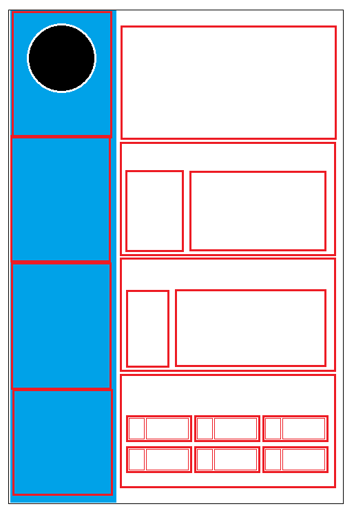

# My-CV

My first CV

## Presentation du projet

-   Nom du projet : Curriculum vitae
-   Autreur : [Nordine Becode](https://github.com/ElazzouziNordineBeCode) - [Repository](https://github.com/ElazzouziNordineBeCode/My-CV)
-   Formation réaliser chez : [BeCode](https://becode.org/) à [BeCentral](https://becode.org/fr/a-propos-de-nous/nos-campus/bruxelles/) Bruxelles.
-   Instructeur : [Mike](https://github.com/Mike00001)

## Pourquoi se Repository ?

Dans le cadre d'un exercice, fait au cours de ma formation pour devenir Fulle Stack Junior Developper, il nous a êtes demander d'exécuter plusieurs actions pour vérifier si on avait bien compris le fonctionnement de Grid en CSS.

Pour cela, j'ai imaginé un CV sur lequel plusieurs boite serait utiliser pour la différente expérience et informations.

Voici le modèle que j'ai créé pour réaliser le CV. Avec ce modèle, je vais pouvoir pleinement utiliser le Grid dans chaque section :

